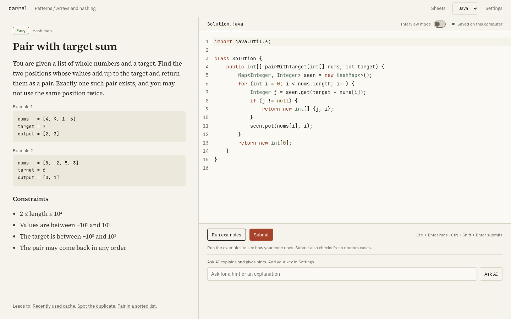
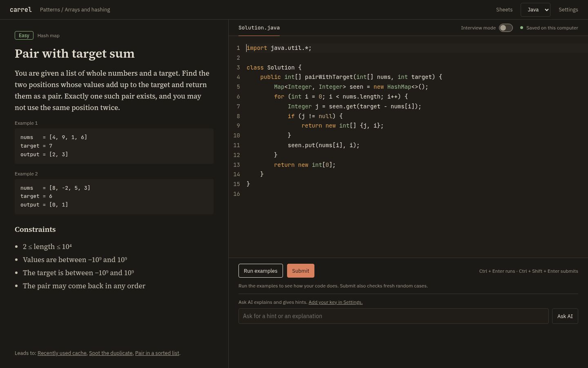

# Carrel

Practise data structures and algorithms in your browser, on your own computer. One small program, no account, nothing uploaded. It runs your Java or C++ with the compilers you already have, and keeps your solutions as plain files.

| Paper | Ink |
| --- | --- |
|  |  |

```
carrel           # starts a local server and opens your browser
carrel doctor    # checks that Java and C++ compilers are installed
carrel export    # saves all your solutions and progress to a zip
carrel version   # prints the version
```

It comes with 183 problems in two sheets: a patterns sheet that builds one idea on the next, and a sheet of problems in the style commonly seen in online assessments. Every Submit runs your code against the examples, fixed edge cases and 50 fresh random cases.

## Install

**Linux and macOS**, into `~/.local/bin` (no sudo, the download is checked against the release checksums):

```
curl -fsSL https://saurabhraghuvanshii.github.io/carrel/install.sh | sh
```

**Windows**, in PowerShell:

```
irm https://saurabhraghuvanshii.github.io/carrel/install.ps1 | iex
```

**By hand:** download the archive for your system from the [releases page](https://github.com/saurabhraghuvanshii/carrel/releases), unpack it, and put `carrel` (or `carrel.exe`) somewhere on your `PATH`. Each archive holds the binary, this README and the licence. `checksums.txt` lists the SHA-256 of every archive.

| System | File |
| --- | --- |
| Linux, Intel or AMD | `carrel_linux_amd64.tar.gz` |
| Linux, ARM | `carrel_linux_arm64.tar.gz` |
| macOS, Apple silicon | `carrel_darwin_arm64.tar.gz` |
| macOS, Intel | `carrel_darwin_amd64.tar.gz` |
| Windows | `carrel_windows_amd64.zip` |

The binaries are not signed yet. On macOS, if you downloaded by hand, run `xattr -d com.apple.quarantine carrel` once; Windows SmartScreen may ask you to confirm the first start.

**With Go** 1.22 or newer:

```
go install github.com/saurabhraghuvanshii/carrel@latest
```

## What is `carrel doctor`

Carrel does not ship a compiler. It uses the ones on your computer: `javac` and `java` (JDK 17 or newer) for Java, `g++` for C++. `carrel doctor` shows which ones it found and their versions:

```
carrel doctor: checking the tools needed to run your code (carrel v0.1.0)
  ok       javac  javac 21.0.4  (/usr/bin/javac)
  ok       java   openjdk version "21.0.4"  (/usr/bin/java)
  missing  g++    install it and make sure it is on your PATH
```

You only need one language. On macOS, `xcode-select --install` gives you a C++ compiler; on Windows, MinGW-w64 or MSYS2 does.

## Where your files live

Everything is in `~/.carrel` (set `CARREL_HOME` to use another folder):

```
~/.carrel/solutions/<problem>.java   your code, as plain files
~/.carrel/solutions/<problem>.cpp
~/.carrel/progress.json              tried / solved
~/.carrel/config.json                theme, accent colour, AI settings (owner-only permissions)
~/.carrel/packs/                     optional extra problem packs
```

Your solutions are ordinary files: open them in any editor, keep them in git, back them up however you like.

## Moving your solutions

```
carrel export [file.zip]              # all solutions and progress in one zip
carrel import <file.zip> [--overwrite]
```

The same two actions are the Export all and Import solutions buttons on the Sheets screen and in Settings. Import only accepts `solutions/<problem>.java`, `solutions/<problem>.cpp` and `progress.json`; anything else in the zip is listed as rejected and never written. Solutions you already have are skipped unless you choose to replace them. Progress is merged: a solved problem stays solved. Limits: 20 MB, 2000 files, 1 MB per solution.

## Adding an AI key

AI help is optional and off until you set it up. Open Settings, choose Anthropic, OpenAI or Ollama (a local model, no key needed), and paste your key. The key is stored in `~/.carrel/config.json`, readable only by you, and is never sent back to the browser. Your code and question go straight from your computer to the provider you picked.

By default the AI explains and gives hints but does not write the full solution. You can turn "Explain only" off in Settings.

## Problem packs

Each problem is a folder with a statement, tests, starter code and a small driver for each language. The built-in packs are inside the binary. To add your own, put pack folders in `~/.carrel/packs/<id>/`; they appear next to the built-in ones on the next start. The pack format is described in [CONTRIBUTING.md](CONTRIBUTING.md#problem-packs).

All statements are written for Carrel. None are copied from other sites.

## Safety

This program runs code on your computer, so the server is locked down:

- it listens on `127.0.0.1` only
- requests for any other Host are refused, which blocks DNS rebinding
- anything that changes state needs an `X-Carrel` header that other websites cannot add
- problem ids and languages are validated before they touch a file path
- the API key is never sent back to the browser

Your own code is not sandboxed beyond these limits, the same as running it yourself:

- 10 seconds for all cases together (30 seconds to compile)
- memory: 256 MB of heap for Java (`-Xmx256m`); 1 GB of address space for C++ on Linux and macOS (`ulimit -v`)
- output: a program that prints more than 16 MB is stopped

If a solution crashes, the case it was on is marked as crashed and the rest run in a new process, up to 5 times.

**Windows:** there is no memory limit for C++ yet (it needs a job object); only the time limit applies. Java keeps its heap limit. This path has not been tested.

## Contributing

Bug reports, problem packs and fixes are welcome. [CONTRIBUTING.md](CONTRIBUTING.md) explains how to build Carrel, how it fits together, the pack format and the checks every change must pass.

## Licence

MIT. See [LICENSE](LICENSE).
